# News API ETL Pipeline

A production-oriented batch ETL pipeline that ingests news articles from the **NewsAPI**, processes and cleans the data using **PySpark**, implements a **Bronze–Silver–Gold medallion architecture**, loads analytical data into **PostgreSQL**, builds a **star schema**, and orchestrates the complete workflow using **Apache Airflow and Docker**.

---

## Project Overview

This project demonstrates an end-to-end data engineering workflow for transforming raw news API data into structured, analytics-ready data.

The pipeline performs:

1. Data ingestion from NewsAPI
2. Data profiling 
3. Data cleaning and standardization
4. Bronze, Silver, and Gold data processing
5. PostgreSQL data warehouse loading
6. Star schema construction
7. Analytical queries
8. Airflow orchestration
9. Docker-based execution
10. Environment-based secret management

---

## Architecture

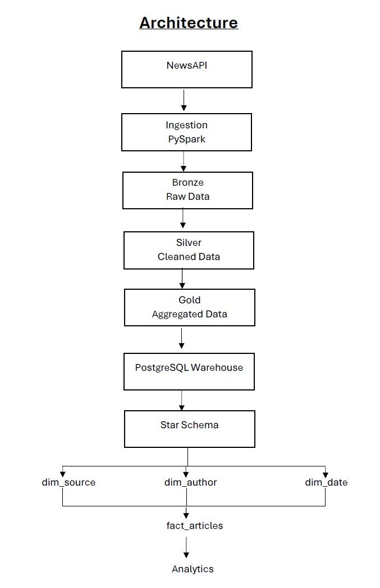

### Orchestration

The complete workflow is orchestrated using Apache Airflow:

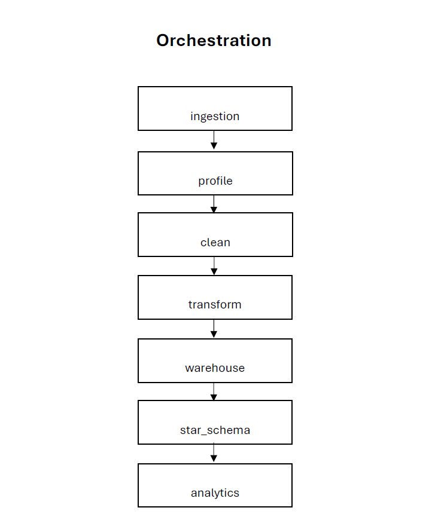

---

## Technologies Used


 Python         - Pipeline development                           
 PySpark        - Distributed data processing and transformation 
 NewsAPI        - External data source                           
 PostgreSQL     - Data warehouse                                 
 Apache Airflow - Workflow orchestration                         
 Docker         - Containerization                               
 YAML           - Configuration management                       
 SQL            - Data warehouse analytics                       
 Git / GitHub   - Version control                                

---

## ETL Pipeline

### 1. Data Ingestion

News articles are retrieved from NewsAPI using the configured search parameters.

The ingestion process:

* Builds the API URL
* Builds request headers
* Builds query parameters
* Sends the API request
* Validates the HTTP response
* Stores the raw response
* Loads the data using PySpark

---

### 2. Data Profiling

The pipeline profiles the incoming dataset to understand:

* Record count
* Schema Summary
* Data types
* Null value count
* Duplicate urls count
* Source distribution
* Descriptive statistics

---


### 3. Data Cleaning

The cleaning stage performs operations such as:

* Removing duplicate articles
* Replace missing author names
* Replace missing description
* Replace missing articles content
* Converting date fields
* Validating article URLs

---

### 4. Data Transformation

The transform stage performs operations such as:

* Aggregate articles by source
* Aggregate articles by publication date
* Aggregate articles by author
* Categorize articles based on image category
* Generate summary metrics for the gold layer

---


## Medallion Architecture

The pipeline follows a Bronze–Silver–Gold architecture.

### Bronze Layer

Contains the raw ingested data with minimal transformation.

```text

NewsAPI -> Bronze


```

Purpose:

* Preserve raw data
* Maintain an original representation of the source data
* Provide a starting point for downstream processing

### Silver Layer

Contains cleaned and standardized data.

Purpose:

* Remove duplicates
* Standardize data
* Handle invalid records
* Prepare data for analytics

### Gold Layer

Contains analytics-ready datasets.

The project generates datasets including:

```text
articles_by_source
articles_by_date
articles_by_author
articles_with_images
summary_metrics
```

---

# Data Warehouse

PostgreSQL is used as the analytical data warehouse.

The pipeline loads processed data into PostgreSQL and creates a dimensional model for analytical queries.

---

## Star Schema

The project implements a star schema centered around the `fact_articles` table.

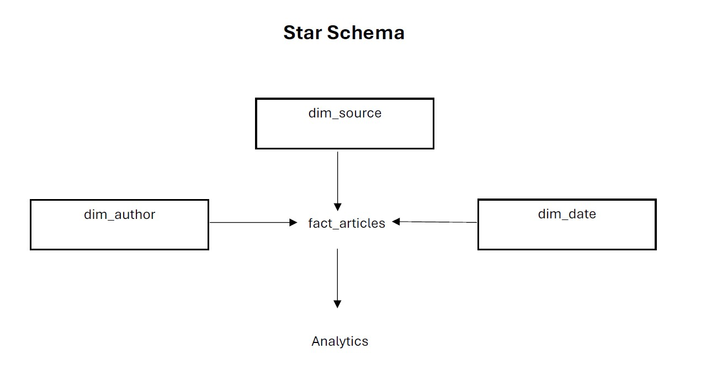
### Fact Table

#### `fact_articles`

**Grain:**

> One row represents one news article.

Important columns include:

```text
article_key
source_key
author_key
date_key
title
description
url
urlToImage
PublishedAt
content
has_image
```

### Dimension Tables

#### `dim_source`

Contains news source information.

```text
source_key
source_id
source_name
```

#### `dim_author`

Contains author information.

```text
author_key
author_name
```

#### `dim_date`

Contains calendar attributes for article publication dates.

```text
date_key
full_date
day
month
month_name
quarter
year
weekday
```

---

## Analytics

The project performs analytical queries against the PostgreSQL warehouse.

Current analytics include:

* Articles by Source
* Articles by Date
* Articles by author
* Articles by source and date
* Articles by author and date
* Articles by source, author and date

---

# Apache Airflow

Apache Airflow is used to orchestrate the complete ETL workflow.

The DAG is:

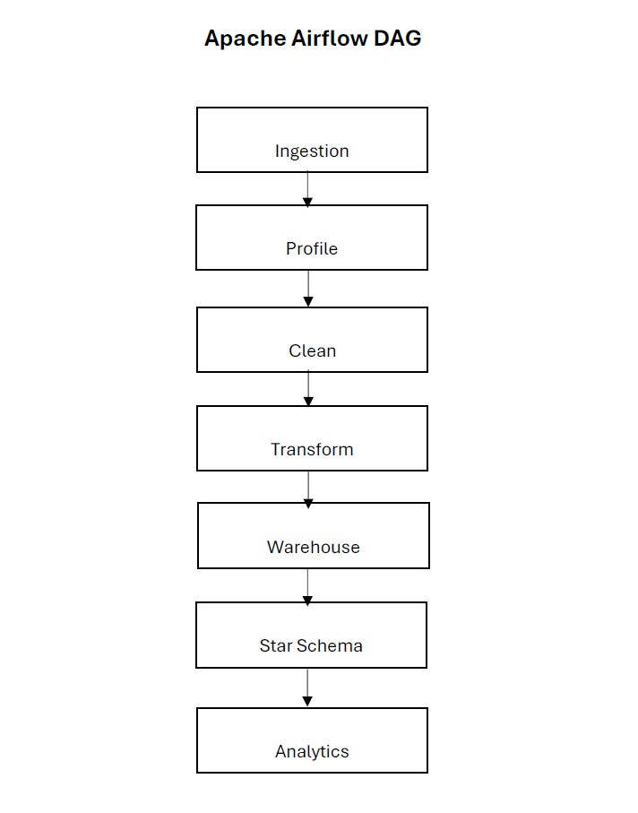


### Retry Configuration

Transient failures are handled using Airflow retries.

```python
default_args = {
    "retries": 2,
    "retry_delay": timedelta(minutes=5)
}
```

---

# Docker

The Airflow environment is containerized using Docker.

The project contains:

```text
Dockerfile
docker-compose.yaml
```

The Docker Compose environment includes:

```text
Airflow Webserver
Airflow Scheduler
Airflow Init
PostgreSQL
```

This provides a consistent environment for running the orchestration layer.

---

# Configuration & Secrets

Sensitive configuration values are not hardcoded into the source code.

The NewsAPI key is supplied through an environment variable.

Example:

```text
.env
```

The `.env` file is excluded from Git using `.gitignore`.

The configuration file contains an empty placeholder:

```yaml
newsapi:
  api_key: ""
```

The actual secret is supplied through the runtime environment.

> **Never commit `.env` or API keys to GitHub.**

---

# Project Structure
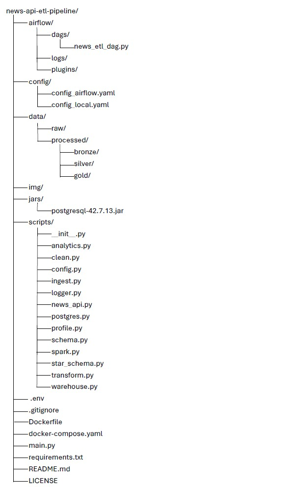

> `.env` is included above only to show the local project structure. It should **not** be committed to GitHub.

---

# Configuration

The project uses YAML configuration files for pipeline settings.

Configuration includes:

* Spark settings
* NewsAPI settings
* Input paths
* Output paths
* Logging
* PostgreSQL connection details

For local execution, use the local configuration.

For Airflow execution, the Airflow configuration is used.

Sensitive values such as API keys are supplied through environment variables.

---

# Running the Project

## 1. Clone the repository

```bash
git clone https://github.com/midhunraj-303/news-api-etl-pipeline.git
cd news-api-etl-pipeline
```

## 2. Create the environment file

Create:

```text
.env
```

Add your NewsAPI key using the environment-variable name expected by the project.

Do not commit this file.

---

## 3. Install dependencies for local execution

Create a virtual environment:

```bash
python -m venv venv
```

Activate it on Windows:

```powershell
venv\Scripts\activate
```

Install dependencies:

```bash
pip install -r requirements.txt
```

---

## 4. Run with Docker and Airflow

Build the Docker images:

```bash
docker compose build
```

Start the services:

```bash
docker compose up -d
```

Check running containers:

```bash
docker compose ps
```

Airflow Webserver:

```text
http://localhost:8080
```

Open the `news_api_etl_pipeline` DAG and trigger it manually.

---


# Logging

The pipeline uses Python logging to record execution details.

Logs include information about:

* Spark session creation
* API requests
* Data ingestion
* Data profiling
* Cleaning
* Transformation
* Warehouse loading
* Star schema creation
* Analytics
* Errors and failures

Airflow also maintains task-level logs for each DAG execution.

---

# Future Improvements

Possible future enhancements include:

* Automated unit and integration tests
* GitHub Actions CI/CD
* Data-quality testing framework
* Airflow monitoring and alerting
* Cloud deployment
* Amazon S3 data lake
* AWS Glue processing
* Amazon Redshift data warehouse
* Power BI dashboard
* Improved incremental loading
* Slowly Changing Dimensions
* Production secret management using a cloud secrets manager


---

# Screenshots

### Project Folder Structure


---

### Airflow Dag


---

## Tables

#### articles_by_author
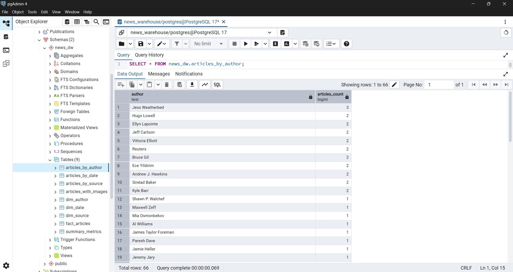
---

#### articles_by_source
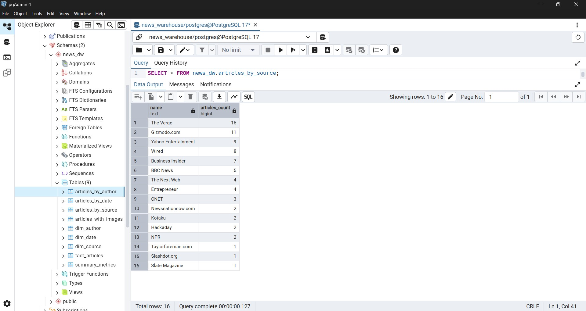
---

#### articles_by_date
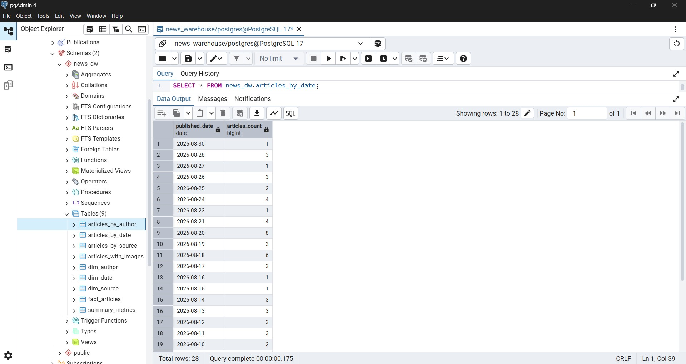
---

#### articles_with_image
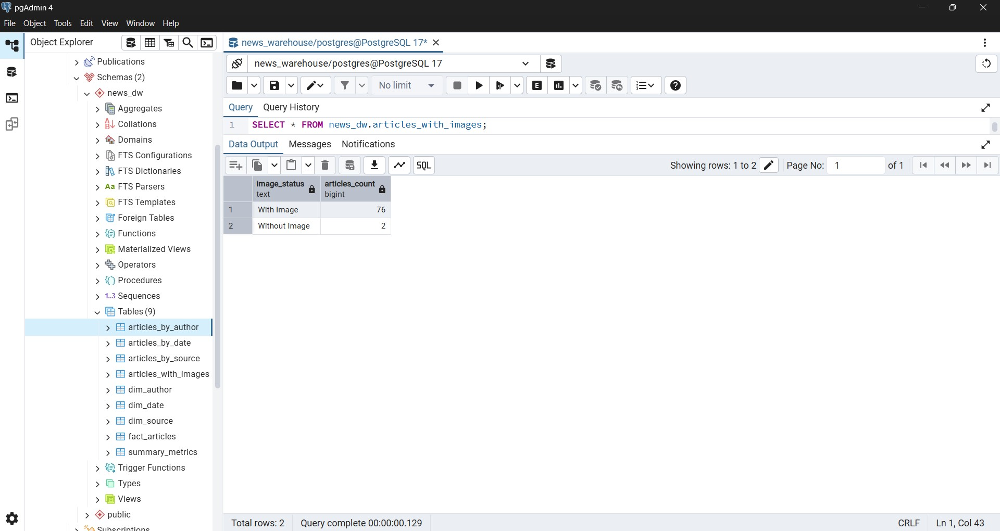
---

#### summary_metrics
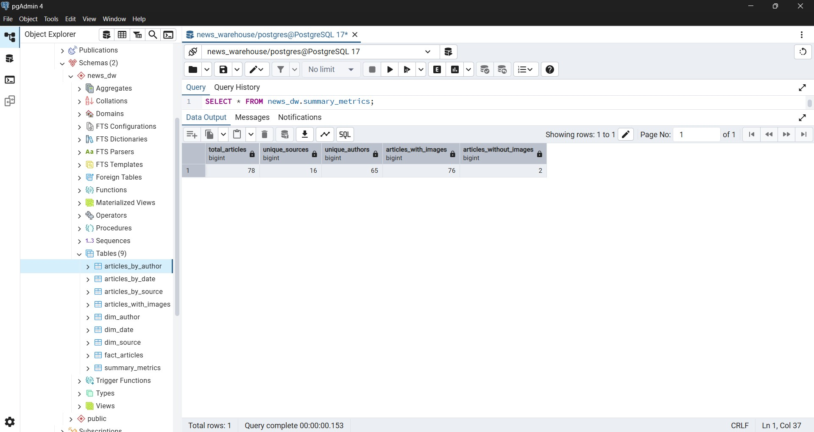
---

## Fact Table

#### fact_articles
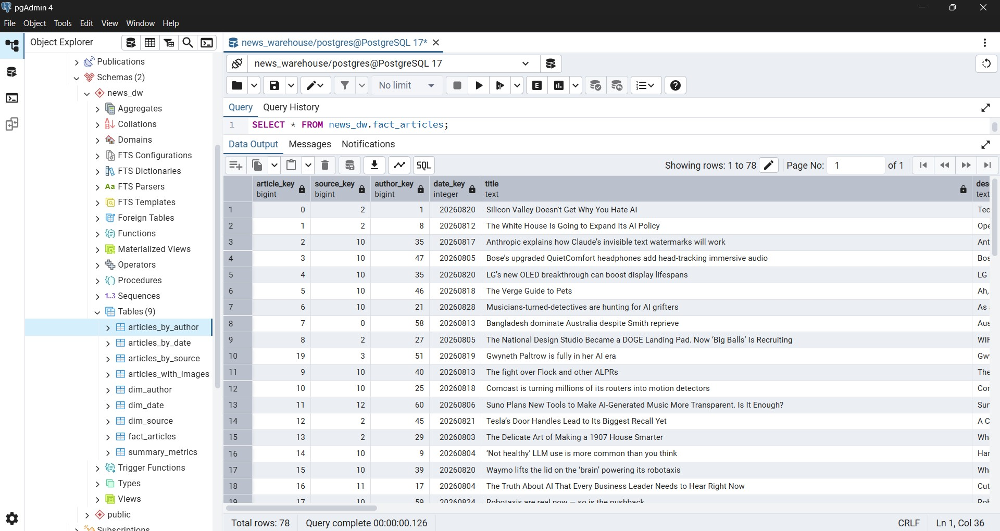
---

## Dimension Tables

#### dim_author
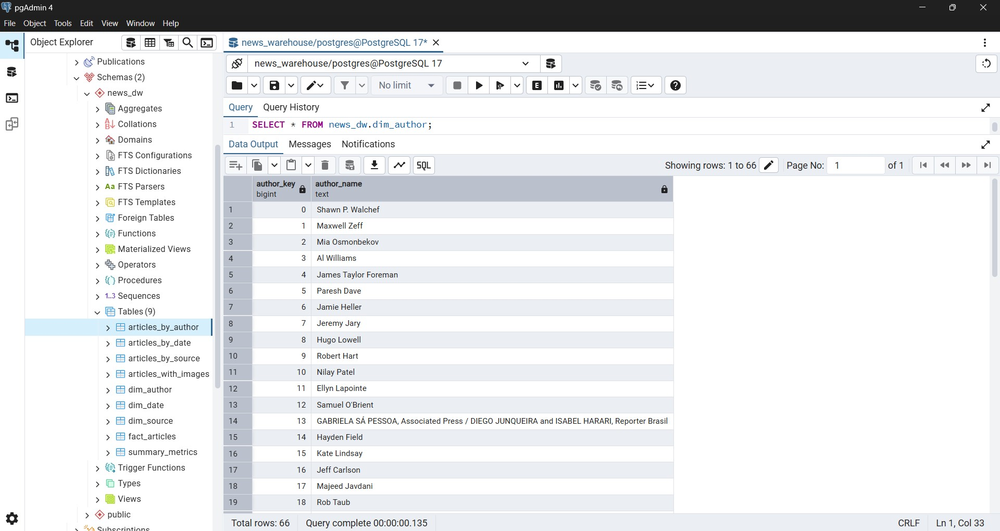
---

#### dim_date
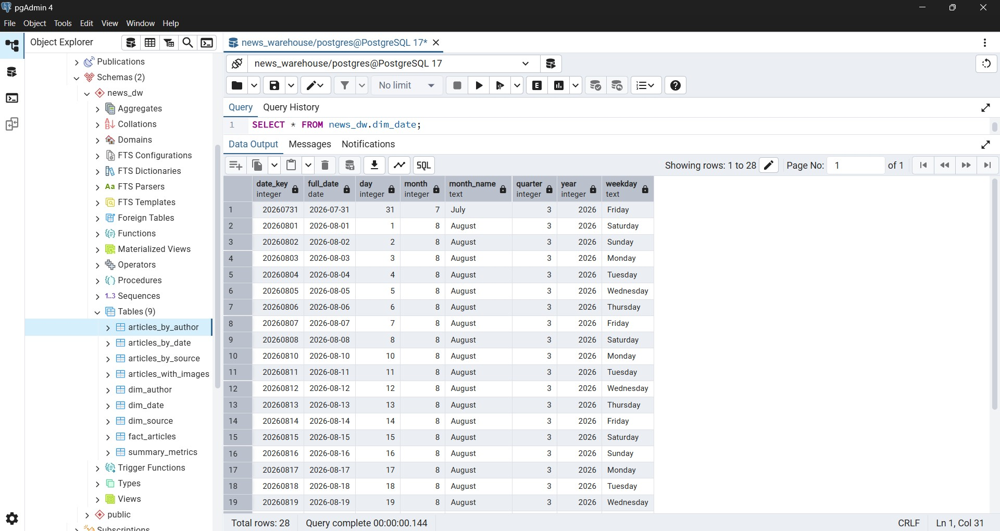
---

### dim_source
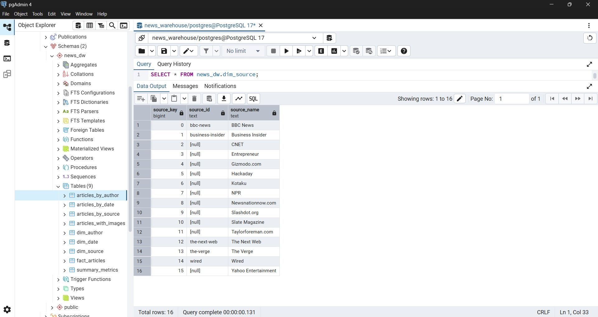
---


# Project Goal

The goal of this project is to demonstrate how a raw external API data source can be transformed into a structured analytical data platform using modern data engineering technologies.

# Author

**Midhun Raj**

Data Engineering | PySpark | Apache Airflow | PostgreSQL | Docker 

- GitHub: https://github.com/midhunraj-303

- LinkedIn: https://www.linkedin.com/in/midhun-raj-a80878244/

---

# License

This project is licensed under the MIT License. See the LICENSE file for details.
